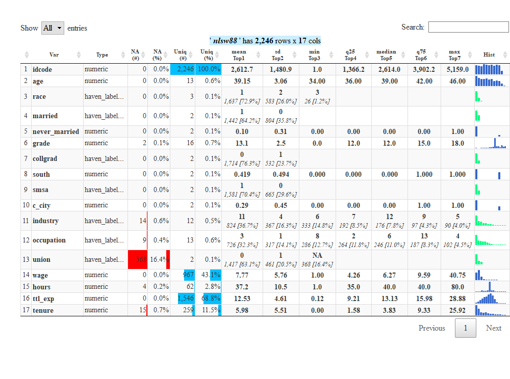

<!-- README.md is generated from README.Rmd. Please edit that file -->

# efun

<!-- badges: start -->

[](https://github.com/edalfon/efun/actions)
[](https://codecov.io/gh/edalfon/efun)
[](https://github.com/edalfon/efun/actions)
<!-- badges: end -->

`efun` is a miscellaneous package. A collection of functions that I have
accumulated over the years and used for various tasks. For a long time
it was just a private package, only shared sometimes with collaborators.

Most functions do not have much guardrails, though.

## Installation

You can install from Github:

``` r
remotes::install_packages_github("edalfon/efun")
```

## Example

``` r
nlsw88 <- haven::read_dta('http://www.stata-press.com/data/r15/nlsw88.dta')
efun::abridge_df(nlsw88)
```

<!-- -->

See `efun`’s web site <https://edalfon.github.io/efun> for some more
[examples](https://edalfon.github.io/efun/articles/efun.html) and [all
functions](https://edalfon.github.io/efun/reference/index.html)
